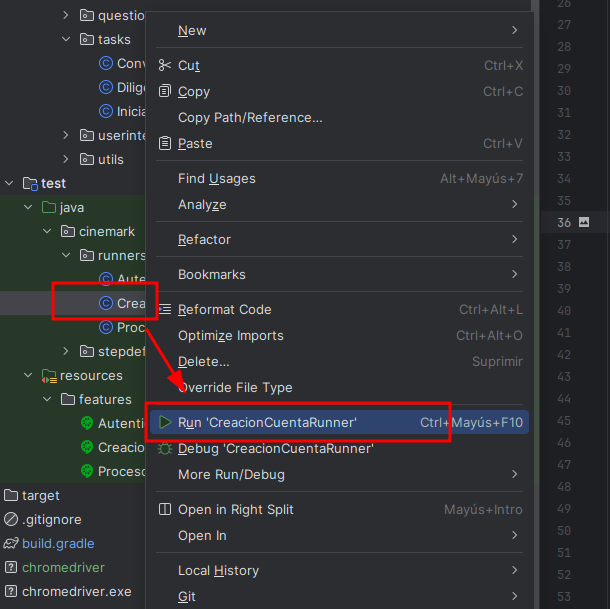

# test-web-Cinemark

## Descripción y contexto

---  
Automatización de pruebas del flujo web del portal de Cinemark, creada con el patrón Screenplay usando el
framework [Serenity BDD](https://serenity-bdd.github.io/docs/guide/user_guide_intro) y usando tecnologías java y
Selenium.


### librerías

---  

Requisito para ejecutar **[JDK 11.0.11](https://www.oracle.com/co/java/technologies/javase-jdk11-downloads.html)**
y  **[gradle 5.2.1](https://gradle.org/install/)** o superior.

Versiones de las librerías con las que es estable la automatización:

+ serenity 2.1.4
+ CucumberVersion 1.9.51
+ hamcrest-core 2.2

#### Ejemplo comando de ejecución:

Para ejecutar un runner específico:
```   gradlew clean test -Prunner="AutenticacionRunner" aggregate --info ``` en Ubuntu como es mi caso ```./gradlew clean test...```

Para ejecutar toda la batería de pruebas:
```   gradlew clean test  aggregate  ```
---  
## Ejecución de pruebas

Para ejecutar por medio del IDE basta con dar click derecho sobre cada runner y hacer click sobre Run (nombre del archivo)
como se muestra en la imagen a continuación


---
Para generar información en consola de la ejecución de pruebas y tener una previa del resultado usamos la propiedad
´--info´, así:
```   gradlew test -Prunner="AutenticacionRunner"  --info```

---
Para ejecutar la batería completa de pruebas se puede utilizar el siguiente comando en consola:
``` gradlew test ```  en Ubuntu como es mi caso ```./gradlew test```
